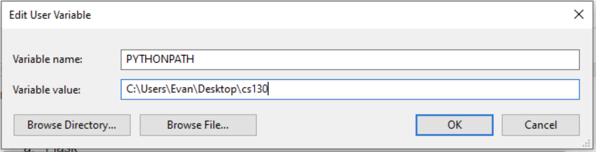
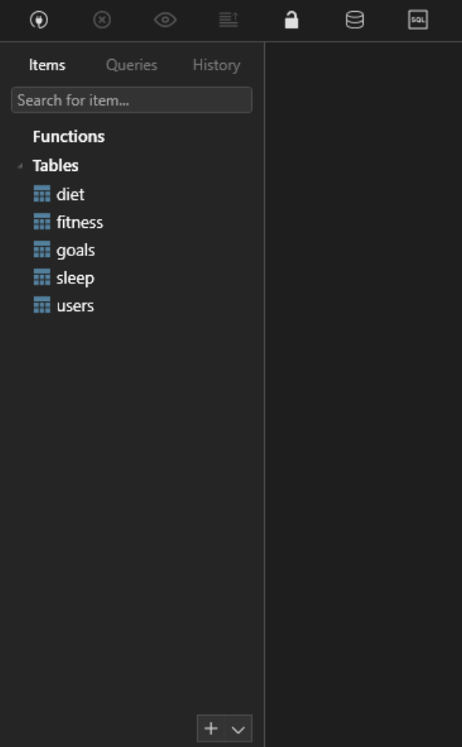
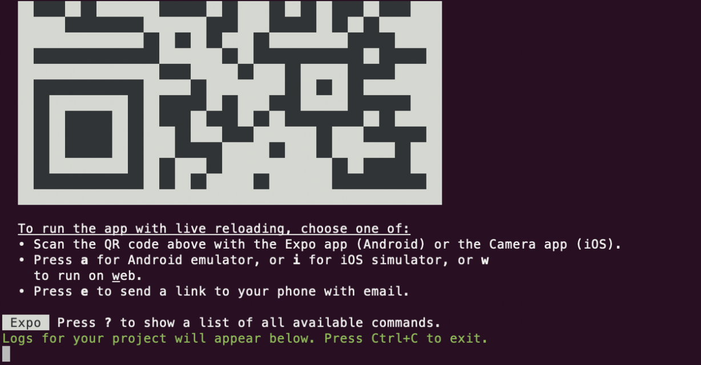
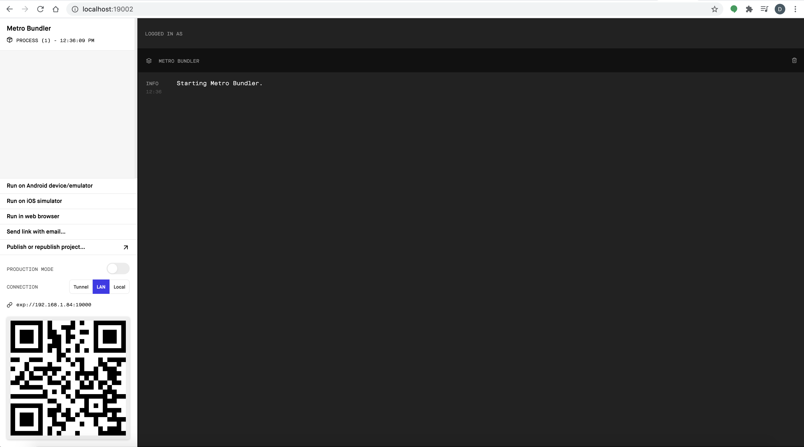
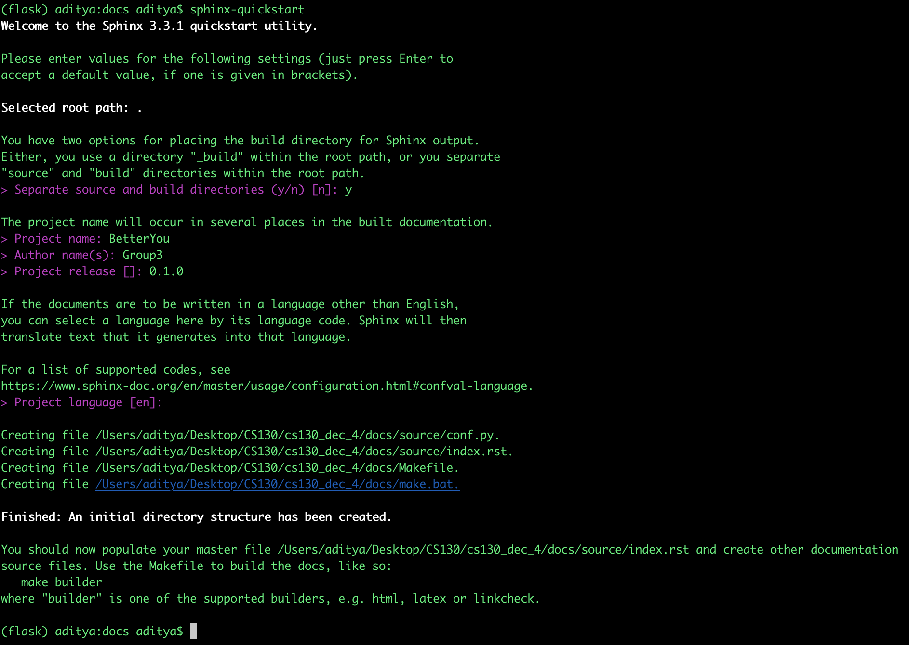
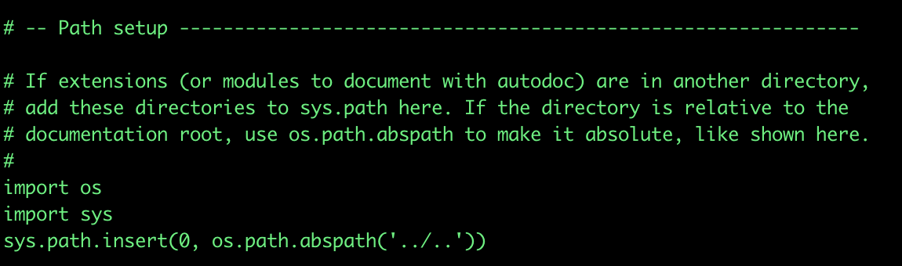
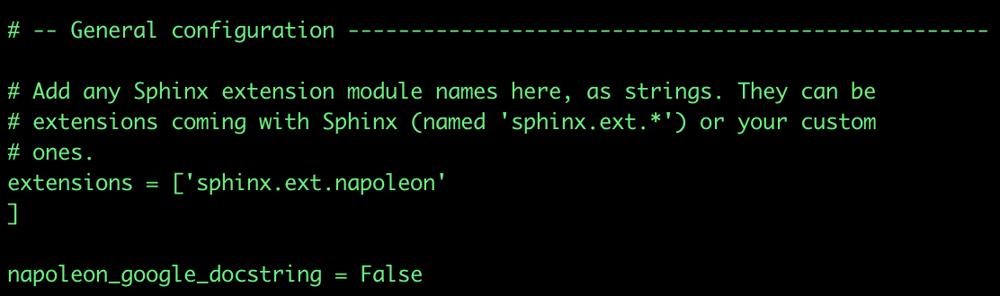
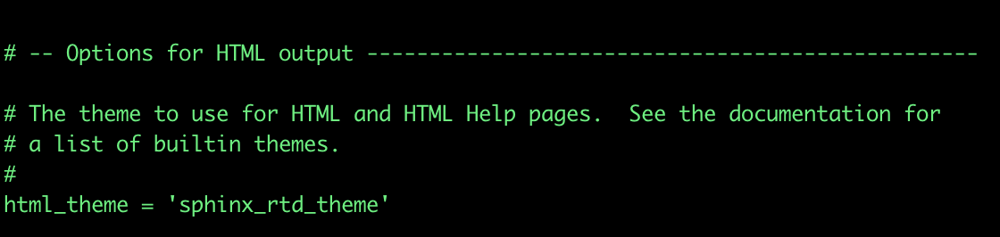
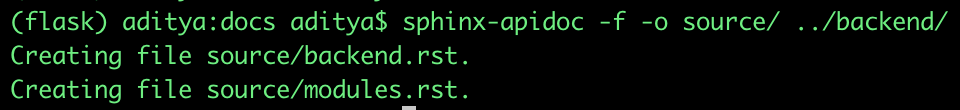
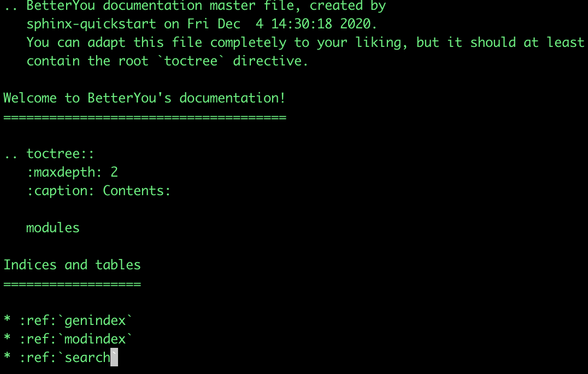

# BetterYou

## Prerequisites

- python 3.7 (or later)
- Node.js v14.15.0 (or later)

## Directory Structure

The frontend of the project lives inside the `client/` folder. Inside this folder,

- the `app/` folder holds the majority of the frontend source code, organized into subdirectories of:
  - `components/` for holding reusable React Native components
  - `config/` for holding centralized configurations
  - `context/` for holding React Context components
  - `navigation/` for holding React Navigation components
  - `Screens/` for holding high level screen components
  - `services/` for holding our application's api layer
  - `utils/` for misc. utilities
- the `__tests__` folder holds tests

The backend of the project lives inside the `backend/` folder. This folder contains all the backend code. Inside this folder, 

- `setup/` for holding the backend instruction, configuration setup
- `backend_tests/` for holding the backend tests.


## Installation and Getting Started

### Backend

To get started running our backend server:

1. Install the latest version of Python (3.7 or higher)
2. In the terminal, install the dependencies by running:
   ```
   pip install -r backend/requirements.txt
   ```
3. Install MySQL:
   - On Mac, follow the instructions on https://dev.mysql.com/doc/mysql-osx-excerpt/5.7/en/osx-installation-pkg.html
   - On Windows, do the following:
     1. Download and run the installer from https://dev.mysql.com/downloads/installer/
     2. Select "server only" option to get less bloatware
     3. Follow the configuration steps to configure the root password. (everything else is can be left as default)
4. Install TablePlus (https://tableplus.com/) to create and view your MySQL databases

   1. Open TablePlus and click on “Create a new connection” and select “MySQL” in the dropdown menu
   2. Fill in the following fields:

      - Name - anything you want, (e.g. “CS 130”)
      - Host - localhost (i.e. 127.0.0.1)
      - Port - 3306 (default MySQL port)
      - User - root
      - Password - whatever password you used during MySQL installation

   3. Save and connect by double clicking the new connection you made
   4. Create a database (ctrl + k on Windows, cmd + k on Mac)
      - Name it whatever you want, but remember the name
      - Make sure to create a database for test and one for production
      - Open the database, there should be no tables in the database yet
   5. Create new tables using the backend table script

      - Configure the config file in backend/setup/config.py by setting the _password_ and _db_ properties to the new database you created
      - Add a [system environment](https://www.architectryan.com/2018/08/31/how-to-change-environment-variables-on-windows-10/) variable called PYTHONPATH with a path to the repository. This allows Python to recognize and import any custom modules referenced in the backend code.
        

        - On Mac, this can be done on the terminal with the command: `export PYTHONPATH="/path/to/cs130/"` (e.g. `export PYTHONPATH="/Users/davidlee/Documents/ucla/cs130/"`). For a more perment solution, add that line to your `~/.bash_profile`

   6. Now you are finally ready to run the backend script. On Windows, **make sure to reload powershell** to save the environment variable changes. Then run:

      ```sh
      python3.7 setup/set_up_db.py
      ```

   7. Confirm that the tables were added by reloading the table list in TablePlus by pressing F5.
   8. Double click on any table to view the entries in the table (they’re empty for now, but you can see the properties associated w/ each).
      

5. Finally, you can start the server by running:

   ```
   python3.7 app.py
   ```

   It will log any requests sent to the server for debugging purposes.

### Frontend

1. Check that you have node installed with:

   ```sh
   node --version
   ```

   If you do not have it installed, this [guide may be useful](https://nodesource.com/blog/installing-node-js-tutorial-using-nvm-on-mac-os-x-and-ubuntu/). Or on Windows, this [guide may be useful](https://codeburst.io/nvm-for-windows-how-to-install-and-use-13b7a4209791).

   For development, we used v14.15.0.

2. Install expo-cli globally with:

   ```sh
   npm i -g expo-cli
   ```

3. Change directories(e.g. `cd`) into the `client/BetterYou` directory

4. Install dependencies with:

   ```sh
   npm install
   ```

5. Start the app (**Note, you should be running the backend on a separate terminal window before trying to run the app.**):

   ```sh
   npm start
   ```

   The terminal should output:
   

   And a browser window should open with the Metro Bundler:
   

6. To Run the app on your personal device (iOS):

   - Download and install the "Expo Client" app from the App Store
   - Open the default camera app on your phone and use it to scan the QR code. This should bring up a push notification asking you if you want to open the app in Expo.
   - Tap on the push notification to open the app in the Expo Client

7. To run the app on iOS simulator (Mac users only):

   - Make sure you have XCode installed. Or install it [here](https://developer.apple.com/xcode/).
   - Open XCode, at the top bar, go to XCode -> Open Developer Tools -> Simulator
   - From the simulator, you can choose the type of device from File- -> Open Device
   - Then from the terminal that is running the app, you can press “i” to run the app in your simulator (or in the Metro Bundler, click “Run on iOS simulator”)

8. To run the app on an Android Emulator:
   - Follow the [guide](https://docs.expo.io/workflow/android-studio-emulator/) to set up your Android emulator. You will need to install Android Studio and select which device to emulate.

## Testing

On the front end, we use [Jest](https://jestjs.io/) as the testing library. To perform automated testing, go to the `client/BetterYou` directory and run:

```
npm test
```

On the backend, we will be testing using Python's unittest framework. For our unit and component tests, we created a shell script to set up the test database, run the tests, give coverage and pass/fail statistics, and then remove the tables from the database. Just run:

```
./backend/backend_tests/run_all_tests.sh
```

For our functional tests:
1. Set up test database:
   ```
   python3.7 backend/backend_tests/set_up_test_db.py
   ```
2. Run test instance of app:
   ```
   python3.7 backend/app.py test
   ```
3. Run functional tests (it will show you pass/fail statistics:
   ```
   python3.7 backend/backend_tests/test_app.py
   ```
4. Done! If desired, remove all the tables/data from test database with:
   ```
   python3.7 backend/backend_tests/drop_test_tables.py
   ```

## Doc Generation

### Frontend

The frontend documentation is automatically generated using [Documentation.js](https://documentation.js.org/).

The generated HTML file can be found under: `client/BetterYou/frontendDocumentation`.

Here are the steps to reproduce/update the automatic generation of frontend documentation:

1. Globally install Documentation.js using the [npm](https://www.npmjs.com/) package manager:

   ```sh
   npm install -g documentation
   ```

2. After installation, move to the BetterYou directory:

   ```sh
   cd ./client/BetterYou
   ```

3. generate the HTML documentation with this command:

   ```sh
   documentation build ./app/** --config documentation.yml -f html -o frontendDocumentation
   ```

4. After completion, the command should have updated the index.html file in the frontendDocumentation folder.

### Backend

The html link to the backend documentation: `docs/source/build/backend.html`

We follow this [link](https://shunsvineyard.info/2019/09/19/use-sphinx-for-python-documentation/) to generate Sphinx documentation.

1. Install Sphinx and Sphinx-RTD-Theme: `pip install -U sphinx` and `pip install sphinx_rtd_theme`

2. Create a `docs/` folder. We already have one `cs130/docs`, to redo the documentation generation just delete current `docs` and create a new `docs` folder inside `cs130`.

3. Go to the `docs/` folder in the terminal and run `sphinx-quickstart`. You will be asked a set of questions, use the following answers:

   

4. Configure the `conf.py` file. Open `docs/source/conf.py` and use the following configurations:

   - Path Setup: Uncommend the three lines and use the following path:
     

   - Use the following extensions:
     

   - Set the html theme:
     

5. Go back to the `cs130/docs` folder and run `sphinx-apidoc -f -o source/ ../backend/`. It should create two rst files:
   

6. Open the file `cs130/docs/source/index.rst` and add the word modules to it:
   
7. Go back to the `cs130/docs` folder and run `make html`. The backend html file: `docs/source/build/backend.html`
